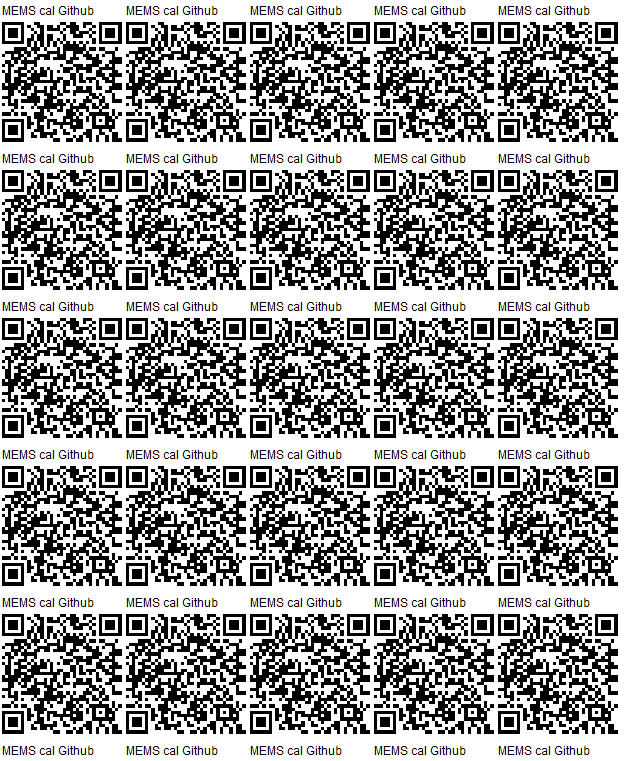
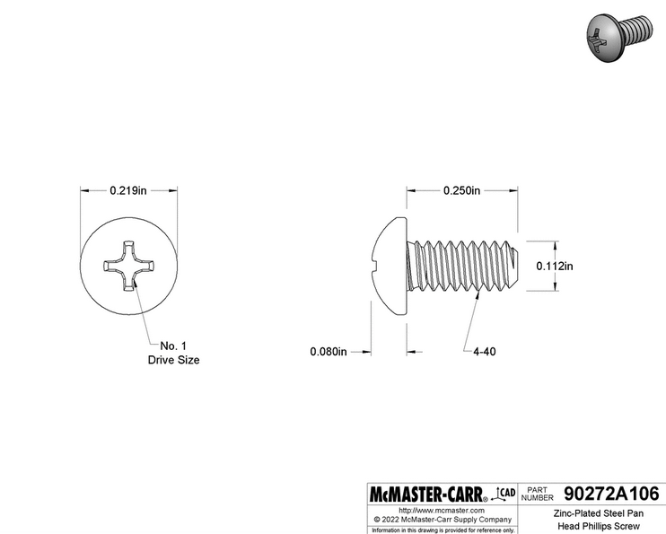
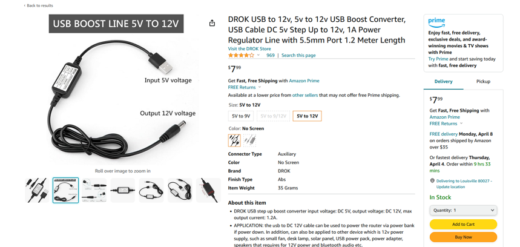
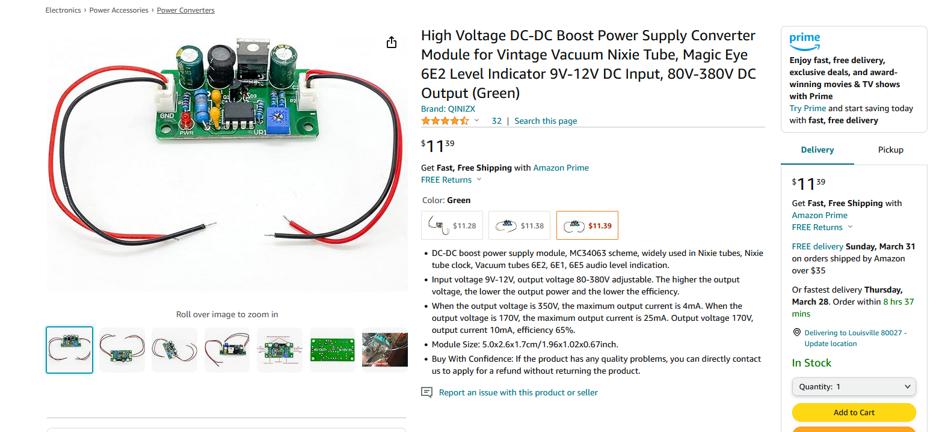

# [memscal](https://github.com/lafefspietz/memscal)

Open-source MEMS-based calibration system for quantum microwave metrology

# System Elements

 - rack mount controller
 	- wood panel
 	- button and light control board
 	- aluminum enclosure
 	- DB25 board
 	- arduino shield
 	- arduino code
 	- arduino UNO
 	- 3d printed parts
 	- DC DC converters
 - cold assembly
 	- h bracket
 	- standoff
 	- outside bracket
 	- center bracket
 	- hex standoffs
 	- rectangle 11 board
 	- microD breakout board

# Rack Mount Controller


## Wood Panel

Buy a 24 inch long by 4 inch wide 1/2 inch thick white oak board:

[](https://ocoochhardwoods.com/scroll-saw-lumber/WhiteOak/ 
)

[](https://ocoochhardwoods.com/scroll-saw-lumber/WhiteOak/ 
)

Cut it down to 19 inches, and sand off rough edges of saw cut.

Drill loose #10 clearance holes in from edges 5/16" in from edge and up and down from center by 1.5 inches.

## To do:

 - add dimensioned drawings to brackets in this document
 - add dimensioned drawing of Arduino UNO with all the holes
 - add all the Altium files and screen shots including schematics, and bills of materials
 - add all the gerber files with information about orders from pcbway
 - add links to all the data sheets
 - build a front panel for the 6 port switches using frontpanel express
 - write and test the code for the six port switch, get more information on that from Logan and Jordan
 - figure out how to add the dc connectors myself without getting those sent out
 - test every single pin
 - rewrite code for 8 port switch and test it
 - build an 8 port front panel 
 - look into larger wood screws or different heads so they don't strip as easily
 - add buttons, lights, resistors to this document
 - add capacitors to this document
 - add headers to this document
 - add arduino code to this document(6 pole, 9 pole, 8 pole)
 - add python control code to this document
 - add matlab control code to this document
 - add links to Hamdi's switches, links to Eval kit boards, description of the 8 poirt




# 3d Printed parts

## Thread Inserts

[](https://www.3djake.com/ruthex/threaded-insert-4-40-unc-100-pieces)

## 4-40 quarter inch screws

[](https://www.mcmaster.com/90272A106/)

## Arduino Bracket

Use 4-40 brass thread inserts, press them in with a soldering iron

[](https://github.com/lafefspietz/memscal/blob/main/3dprint/arduino-bracket.STL) 

## DC DC converter Bracket

Use 4-40 brass thread inserts, press them in with a soldering iron

[](https://github.com/lafefspietz/memscal/blob/main/3dprint/HV-DCDC-bracket.STL) 

## Front Panel Edge Bracket

Use 4-40 brass thread inserts, press them in with a soldering iron. Attach to wood with #4 wood screws. 

[](https://github.com/lafefspietz/memscal/blob/main/3dprint/front-panel-edge-bracket.STL) 

## Front Panel Center Bracket

place in center area of circuit board to prevent bowing, use #4 wood screws to mount.

[](https://github.com/lafefspietz/memscal/blob/main/3dprint/front-panel-center-bracket.STL) 

# Front Panel Wood Board Assembly

## Board: 1/2 inch by 4 inches by 19 inches, cut from 24 inches

[](https://ocoochhardwoods.com/detail/?i=124wo)

## Wood screws


## 5V to 12V boost

[](https://www.amazon.com/Voltage-Converter-Vintage-Indicator-80V-380V/dp/B09D93QNYK/ref=pd_vtp_h_pd_vtp_h_d_sccl_3/135-2213394-8928934)

## 12 V to 90 V boost


[](https://www.amazon.com/DROK-Boost-Converter-Regulator-Length/dp/B09M3LMSS3/)


```


#include <Adafruit_NeoPixel.h>
#ifdef __AVR__
#endif

// Which pin on the Arduino is connected to the NeoPixels?
#define PIN 19 // On Trinket or Gemma, suggest changing this to 1

// How many NeoPixels are attached to the Arduino?
#define NUMPIXELS 9 // 
//there are 9

// When setting up the NeoPixel library, we tell it how many pixels,  
// and which pin to use to send signals. Note that for older NeoPixel
// strips you might need to change the third parameter -- see the
// strandtest example for more information on possible values.
Adafruit_NeoPixel pixels(NUMPIXELS, PIN, NEO_GRB + NEO_KHZ800);

#define U4_123 2
#define U4_456 3
#define U4_789 4
#define U4_COM 5

#define U1_1 14
#define U1_2 15
#define U1_3 16
#define U1_COM 17

#define U2_4 10
#define U2_5 11
#define U2_6 12
#define U2_COM 13

#define U3_7 6
#define U3_8 7
#define U3_9 8
#define U3_COM 9


int analog = 0;
int delta = 20;
int mode = 1;//modes are 1,2,3,4,5,6,7,8,9 which are pixel 8,7,6,5,4,3,2,1, and 0 respectively


void setup() {
    Serial.begin(115200);


  // These lines are specifically to support the Adafruit Trinket 5V 16 MHz.
  // Any other board, you can remove this part (but no harm leaving it):
#if defined(__AVR_ATtiny85__) && (F_CPU == 16000000)
  clock_prescale_set(clock_div_1);
#endif
  // END of Trinket-specific code.

/*
    pinMode(2,OUTPUT);// DSUB 8,  U4 -> U1
    pinMode(3,OUTPUT);// DSUB 9,  U4 -> U2
    pinMode(4,OUTPUT);// DSUB 10, U4 -> U3
    pinMode(5,OUTPUT);// DSUB 11, U4 COM
    pinMode(6,OUTPUT);// DSUB 14, U3 -> port 7
    pinMode(7,OUTPUT);// DSUB 15, U3 -> port 8
    pinMode(8,OUTPUT);// DSUB 16, U3 -> port 9
    pinMode(9,OUTPUT);// DSUB 17, U3 COM
    pinMode(10,OUTPUT);//DSUB 18, U2 -> 4 
    pinMode(11,OUTPUT);//DSUB 19, U2 -> 5
    pinMode(12,OUTPUT);//DSUB 20, U2 -> 6
    pinMode(13,OUTPUT);//DSUB 21, U2 COM
    pinMode(14,OUTPUT);//DSUB 22, U1 -> 1
    pinMode(15,OUTPUT);//DSUB 23, U1 -> 2
    pinMode(16,OUTPUT);//DSUB 24, U1 -> 3
    pinMode(17,OUTPUT);//DSUB 25, U1 COM
*/

    pinMode(U4_COM,OUTPUT);
    pinMode(U4_123,OUTPUT);
    pinMode(U4_456,OUTPUT);
    pinMode(U4_789,OUTPUT);

    pinMode(U1_COM,OUTPUT);
    pinMode(U1_1,OUTPUT);
    pinMode(U1_2,OUTPUT);
    pinMode(U1_3,OUTPUT);

    pinMode(U2_COM,OUTPUT);
    pinMode(U2_4,OUTPUT);
    pinMode(U2_5,OUTPUT);
    pinMode(U2_6,OUTPUT);

    pinMode(U3_COM,OUTPUT);
    pinMode(U3_7,OUTPUT);
    pinMode(U3_8,OUTPUT);
    pinMode(U3_9,OUTPUT);

    digitalWrite(U1_COM,HIGH);
    digitalWrite(U2_COM,HIGH);
    digitalWrite(U3_COM,HIGH);
    digitalWrite(U4_COM,HIGH);

    digitalWrite(U4_123,HIGH);
    digitalWrite(U4_456,LOW);
    digitalWrite(U4_789,LOW);

    digitalWrite(U1_1,HIGH);
    digitalWrite(U1_2,LOW);
    digitalWrite(U1_3,LOW);
 
    digitalWrite(U2_4,LOW);
    digitalWrite(U2_5,LOW);
    digitalWrite(U2_6,LOW);

    digitalWrite(U3_7,LOW);
    digitalWrite(U3_8,LOW);
    digitalWrite(U3_9,LOW);


  
  pixels.begin(); // INITIALIZE NeoPixel strip object (REQUIRED)

}


void loop() {

    

  pixels.clear(); // Set all pixel colors to 'off'
  analog = analogRead(A4);
  // The first NeoPixel in a strand is #0, second is 1, all the way up
  // to the count of pixels minus one.
  
  if(analog > 1024 - delta){
    delay(1);
    analog = analogRead(A4);
    if(analog > 1023 - delta){
       mode = 1;      
    }
  }
  if(analog > 836 - delta && analog < 836 + delta){
    delay(5);
    analog = analogRead(A4);
    if(analog > 836 - delta && analog < 836 + delta){
         mode = 2; 
    }
  }
  if(analog > 690 - delta && analog < 690 + delta){
     delay(5);
     analog = analogRead(A4);

    if(analog > 690 - delta && analog < 690 + delta){
      mode = 3;    
    }
  }

  if(analog > 569 - delta && analog < 569 + delta){
     delay(1);
     analog = analogRead(A4);

    if(analog > 569 - delta && analog < 569 + delta){
      mode = 4;    
    }
  }

  if(analog > 464 - delta && analog < 464 + delta){
     delay(1);
     analog = analogRead(A4);

    if(analog > 464 - delta && analog < 464 + delta){
      mode = 5;    
    }
  }

  if(analog > 372 - delta && analog < 372 + delta){
     delay(1);
     analog = analogRead(A4);

    if(analog > 372 - delta && analog < 372 + delta){
      mode = 6;    
    }
  }

  if(analog > 283 - delta && analog < 283 + delta){
     delay(1);
     analog = analogRead(A4);

    if(analog > 283 - delta && analog < 283 + delta){
      mode = 7;    
    }
  }

  if(analog > 195 - delta && analog < 195 + delta){
     delay(1);
     analog = analogRead(A4);

    if(analog > 195 - delta && analog < 195 + delta){
      mode = 8;    
    }
  }

  if(analog > 103 - delta && analog < 103 + delta){
     delay(1);
     analog = analogRead(A4);

    if(analog > 103 - delta && analog < 103 + delta){
      mode = 9;    
    }
  }

  if (Serial.available()) {

    //for more info on this code see http://adam-meyer.com/arduino/arduino-serial
    //read serial as ascii integer
     int ser = Serial.read();
    //    Serial.println(ser);
     if(ser == 49){    //ASCII for 1
      mode = 1;
     }
     if(ser == 50){    //ASCII for 2
      mode = 2;
     }
     if(ser == 51){    //ASCII for 3
      mode = 3;
     }
     if(ser == 52){    //ASCII for 4
      mode = 4;
     }
     if(ser == 53){    //ASCII for 5
      mode = 5;
     }
     if(ser == 54){    //ASCII for 6
      mode = 6;
     }
     if(ser == 55){    //ASCII for 4
      mode = 7;
     }
     if(ser == 56){    //ASCII for 5
      mode = 8;
     }
     if(ser == 57){    //ASCII for 6
      mode = 9;
     }


  }

  if(mode == 1){
    pixels.setPixelColor(0, pixels.Color(0, 0, 0));    
    pixels.setPixelColor(1, pixels.Color(0, 0, 0));    
    pixels.setPixelColor(2, pixels.Color(0, 0, 0));    
    pixels.setPixelColor(3, pixels.Color(0, 0, 0));    
    pixels.setPixelColor(4, pixels.Color(0, 0, 0));    
    pixels.setPixelColor(5, pixels.Color(0, 0, 0));    
    pixels.setPixelColor(6, pixels.Color(0, 0, 0));    
    pixels.setPixelColor(7, pixels.Color(0, 0, 0));    
    pixels.setPixelColor(8, pixels.Color(255, 0, 0));    

    digitalWrite(U4_123,HIGH);
    digitalWrite(U4_456,LOW);
    digitalWrite(U4_789,LOW);

    digitalWrite(U1_1,HIGH);
    digitalWrite(U1_2,LOW);
    digitalWrite(U1_3,LOW);
 
    digitalWrite(U2_4,LOW);
    digitalWrite(U2_5,LOW);
    digitalWrite(U2_6,LOW);

    digitalWrite(U3_7,LOW);
    digitalWrite(U3_8,LOW);
    digitalWrite(U3_9,LOW);

    
  }
  if(mode == 2){
    pixels.setPixelColor(0, pixels.Color(0, 0, 0));    
    pixels.setPixelColor(1, pixels.Color(0, 0, 0));    
    pixels.setPixelColor(2, pixels.Color(0, 0, 0));    
    pixels.setPixelColor(3, pixels.Color(0, 0, 0));    
    pixels.setPixelColor(4, pixels.Color(0, 0, 0));    
    pixels.setPixelColor(5, pixels.Color(0, 0, 0));    
    pixels.setPixelColor(6, pixels.Color(0, 0, 0));    
    pixels.setPixelColor(7, pixels.Color(255, 0, 0));    
    pixels.setPixelColor(8, pixels.Color(0, 0, 0));    
    
    digitalWrite(U4_123,HIGH);
    digitalWrite(U4_456,LOW);
    digitalWrite(U4_789,LOW);

    digitalWrite(U1_1,LOW);
    digitalWrite(U1_2,HIGH);
    digitalWrite(U1_3,LOW);
 
    digitalWrite(U2_4,LOW);
    digitalWrite(U2_5,LOW);
    digitalWrite(U2_6,LOW);

    digitalWrite(U3_7,LOW);
    digitalWrite(U3_8,LOW);
    digitalWrite(U3_9,LOW);
 
  }
  if(mode == 3){
    pixels.setPixelColor(0, pixels.Color(0, 0, 0));    
    pixels.setPixelColor(1, pixels.Color(0, 0, 0));    
    pixels.setPixelColor(2, pixels.Color(0, 0, 0));    
    pixels.setPixelColor(3, pixels.Color(0, 0, 0));    
    pixels.setPixelColor(4, pixels.Color(0, 0, 0));    
    pixels.setPixelColor(5, pixels.Color(0, 0, 0));    
    pixels.setPixelColor(6, pixels.Color(255, 0, 0));    
    pixels.setPixelColor(7, pixels.Color(0, 0, 0));    
    pixels.setPixelColor(8, pixels.Color(0, 0, 0));    
    
    digitalWrite(U4_123,HIGH);
    digitalWrite(U4_456,LOW);
    digitalWrite(U4_789,LOW);

    digitalWrite(U1_1,LOW);
    digitalWrite(U1_2,LOW);
    digitalWrite(U1_3,HIGH);
 
    digitalWrite(U2_4,LOW);
    digitalWrite(U2_5,LOW);
    digitalWrite(U2_6,LOW);

    digitalWrite(U3_7,LOW);
    digitalWrite(U3_8,LOW);
    digitalWrite(U3_9,LOW);    

  }
  if(mode == 4){
    pixels.setPixelColor(0, pixels.Color(0, 0, 0));    
    pixels.setPixelColor(1, pixels.Color(0, 0, 0));    
    pixels.setPixelColor(2, pixels.Color(0, 0, 0));    
    pixels.setPixelColor(3, pixels.Color(0, 0, 0));    
    pixels.setPixelColor(4, pixels.Color(0, 0, 0));    
    pixels.setPixelColor(5, pixels.Color(255, 0, 0));    
    pixels.setPixelColor(6, pixels.Color(0, 0, 0));    
    pixels.setPixelColor(7, pixels.Color(0, 0, 0));    
    pixels.setPixelColor(8, pixels.Color(0, 0, 0));    
    
    digitalWrite(U4_123,LOW);
    digitalWrite(U4_456,HIGH);
    digitalWrite(U4_789,LOW);

    digitalWrite(U1_1,LOW);
    digitalWrite(U1_2,LOW);
    digitalWrite(U1_3,LOW);
 
    digitalWrite(U2_4,HIGH);
    digitalWrite(U2_5,LOW);
    digitalWrite(U2_6,LOW);

    digitalWrite(U3_7,LOW);
    digitalWrite(U3_8,LOW);
    digitalWrite(U3_9,LOW);    


  }
  if(mode == 5){
    pixels.setPixelColor(0, pixels.Color(0, 0, 0));    
    pixels.setPixelColor(1, pixels.Color(0, 0, 0));    
    pixels.setPixelColor(2, pixels.Color(0, 0, 0));    
    pixels.setPixelColor(3, pixels.Color(0, 0, 0));    
    pixels.setPixelColor(4, pixels.Color(255, 0, 0));    
    pixels.setPixelColor(5, pixels.Color(0, 0, 0));    
    pixels.setPixelColor(6, pixels.Color(0, 0, 0));    
    pixels.setPixelColor(7, pixels.Color(0, 0, 0));    
    pixels.setPixelColor(8, pixels.Color(0, 0, 0));    

    digitalWrite(U4_123,LOW);
    digitalWrite(U4_456,HIGH);
    digitalWrite(U4_789,LOW);

    digitalWrite(U1_1,LOW);
    digitalWrite(U1_2,LOW);
    digitalWrite(U1_3,LOW);
 
    digitalWrite(U2_4,LOW);
    digitalWrite(U2_5,HIGH);
    digitalWrite(U2_6,LOW);

    digitalWrite(U3_7,LOW);
    digitalWrite(U3_8,LOW);
    digitalWrite(U3_9,LOW);    


  }
  if(mode == 6){
    pixels.setPixelColor(0, pixels.Color(0, 0, 0));    
    pixels.setPixelColor(1, pixels.Color(0, 0, 0));    
    pixels.setPixelColor(2, pixels.Color(0, 0, 0));    
    pixels.setPixelColor(3, pixels.Color(255, 0, 0));    
    pixels.setPixelColor(4, pixels.Color(0, 0, 0));    
    pixels.setPixelColor(5, pixels.Color(0, 0, 0));    
    pixels.setPixelColor(6, pixels.Color(0, 0, 0));    
    pixels.setPixelColor(7, pixels.Color(0, 0, 0));    
    pixels.setPixelColor(8, pixels.Color(0, 0, 0));    

    digitalWrite(U4_123,LOW);
    digitalWrite(U4_456,HIGH);
    digitalWrite(U4_789,LOW);

    digitalWrite(U1_1,LOW);
    digitalWrite(U1_2,LOW);
    digitalWrite(U1_3,LOW);
 
    digitalWrite(U2_4,LOW);
    digitalWrite(U2_5,LOW);
    digitalWrite(U2_6,HIGH);

    digitalWrite(U3_7,LOW);
    digitalWrite(U3_8,LOW);
    digitalWrite(U3_9,LOW);

  }

  if(mode == 7){
    pixels.setPixelColor(0, pixels.Color(0, 0, 0));    
    pixels.setPixelColor(1, pixels.Color(0, 0, 0));    
    pixels.setPixelColor(2, pixels.Color(255, 0, 0));    
    pixels.setPixelColor(3, pixels.Color(0, 0, 0));    
    pixels.setPixelColor(4, pixels.Color(0, 0, 0));    
    pixels.setPixelColor(5, pixels.Color(0, 0, 0));    
    pixels.setPixelColor(6, pixels.Color(0, 0, 0));    
    pixels.setPixelColor(7, pixels.Color(0, 0, 0));    
    pixels.setPixelColor(8, pixels.Color(0, 0, 0));    

    digitalWrite(U4_123,LOW);
    digitalWrite(U4_456,LOW);
    digitalWrite(U4_789,HIGH);

    digitalWrite(U1_1,LOW);
    digitalWrite(U1_2,LOW);
    digitalWrite(U1_3,LOW);
 
    digitalWrite(U2_4,LOW);
    digitalWrite(U2_5,LOW);
    digitalWrite(U2_6,LOW);

    digitalWrite(U3_7,HIGH);
    digitalWrite(U3_8,LOW);
    digitalWrite(U3_9,LOW);

 }
  if(mode == 8){
    pixels.setPixelColor(0, pixels.Color(0, 0, 0));    
    pixels.setPixelColor(1, pixels.Color(255, 0, 0));    
    pixels.setPixelColor(2, pixels.Color(0, 0, 0));    
    pixels.setPixelColor(3, pixels.Color(0, 0, 0));    
    pixels.setPixelColor(4, pixels.Color(0, 0, 0));    
    pixels.setPixelColor(5, pixels.Color(0, 0, 0));    
    pixels.setPixelColor(6, pixels.Color(0, 0, 0));    
    pixels.setPixelColor(7, pixels.Color(0, 0, 0));    
    pixels.setPixelColor(8, pixels.Color(0, 0, 0));    

    digitalWrite(U4_123,LOW);
    digitalWrite(U4_456,LOW);
    digitalWrite(U4_789,HIGH);

    digitalWrite(U1_1,LOW);
    digitalWrite(U1_2,LOW);
    digitalWrite(U1_3,LOW);
 
    digitalWrite(U2_4,LOW);
    digitalWrite(U2_5,LOW);
    digitalWrite(U2_6,LOW);

    digitalWrite(U3_7,LOW);
    digitalWrite(U3_8,HIGH);
    digitalWrite(U3_9,LOW);

  }
  if(mode == 9){
    pixels.setPixelColor(0, pixels.Color(255, 0, 0));    
    pixels.setPixelColor(1, pixels.Color(0, 0, 0));    
    pixels.setPixelColor(2, pixels.Color(0, 0, 0));    
    pixels.setPixelColor(3, pixels.Color(0, 0, 0));    
    pixels.setPixelColor(4, pixels.Color(0, 0, 0));    
    pixels.setPixelColor(5, pixels.Color(0, 0, 0));    
    pixels.setPixelColor(6, pixels.Color(0, 0, 0));    
    pixels.setPixelColor(7, pixels.Color(0, 0, 0));    
    pixels.setPixelColor(8, pixels.Color(0, 0, 0));    

    digitalWrite(U4_123,LOW);
    digitalWrite(U4_456,LOW);
    digitalWrite(U4_789,HIGH);

    digitalWrite(U1_1,LOW);
    digitalWrite(U1_2,LOW);
    digitalWrite(U1_3,LOW);
 
    digitalWrite(U2_4,LOW);
    digitalWrite(U2_5,LOW);
    digitalWrite(U2_6,LOW);

    digitalWrite(U3_7,LOW);
    digitalWrite(U3_8,LOW);
    digitalWrite(U3_9,HIGH);

  }

  
  pixels.show();   // Send the updated pixel colors to the hardware.
  delay(1); // Pause before next pass through loop

//    Serial.println(analog);

}

```


