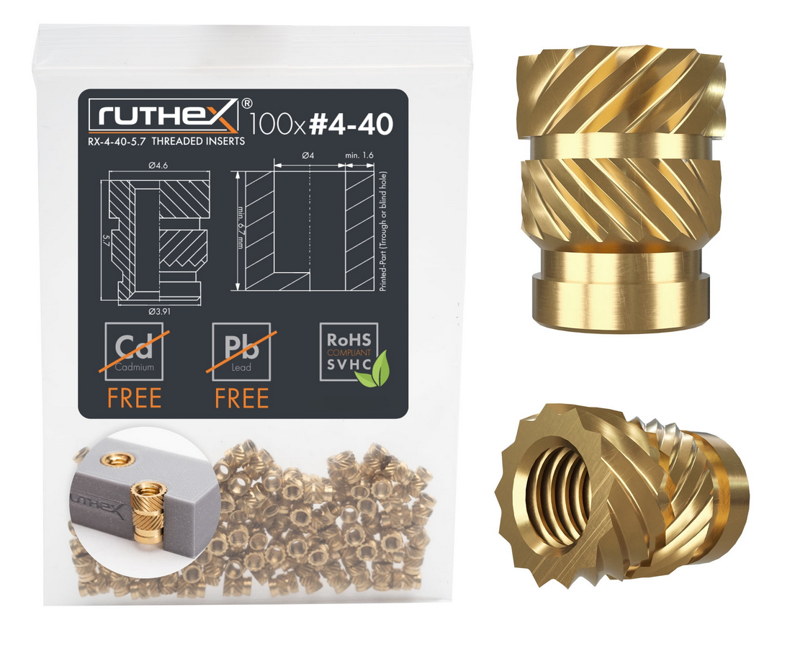

# [memscal](https://github.com/lafefspietz/memscal)

Open-source MEMS-based calibration system for quantum microwave metrology

# 3d Printed parts

## Arduino Bracket

Use 4-40 brass thread inserts, press them in with a soldering iron

 

## DC DC converter Bracket

Use 4-40 brass thread inserts, press them in with a soldering iron

 

## Front Panel Edge Bracket

Use 4-40 brass thread inserts, press them in with a soldering iron. Attach to wood with #4 wood screws. 

 

## Front Panel Center Bracket

place in center area of circuit board to prevent bowing, use #4 wood screws to mount.

 
